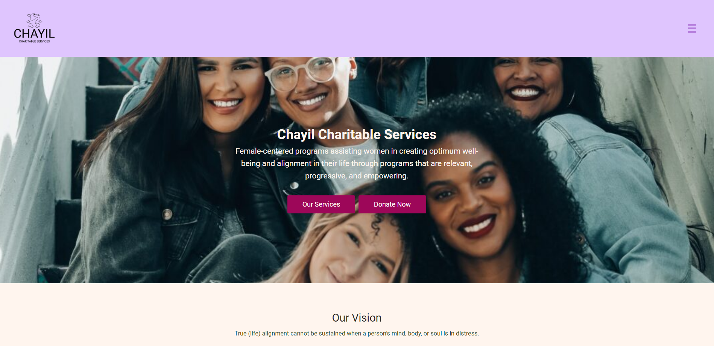
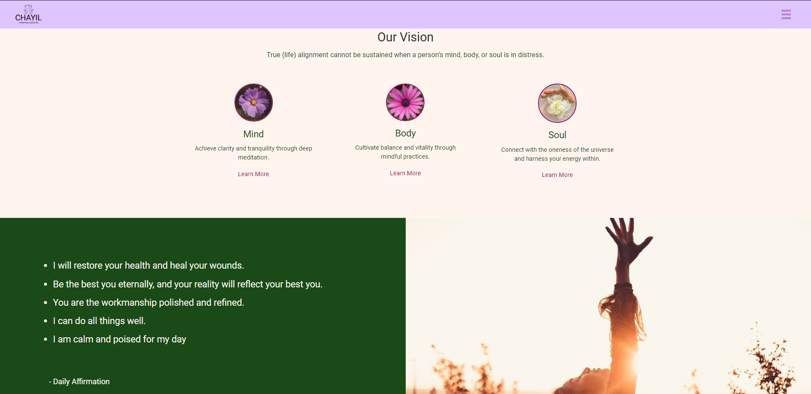
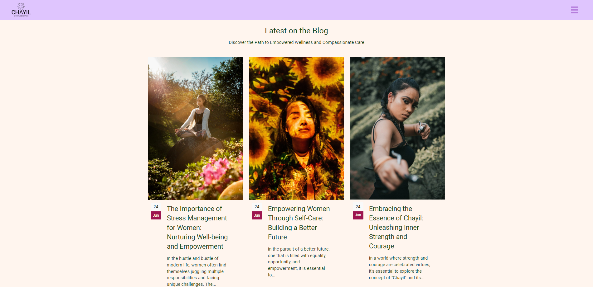
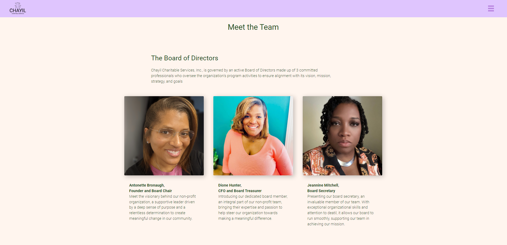
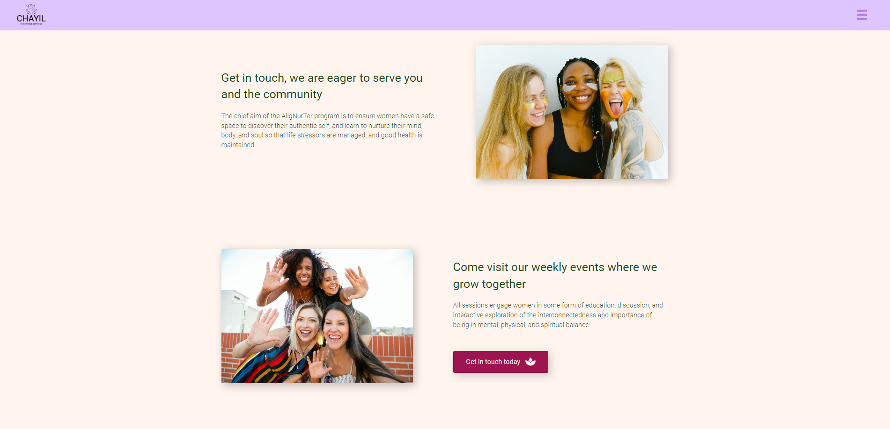
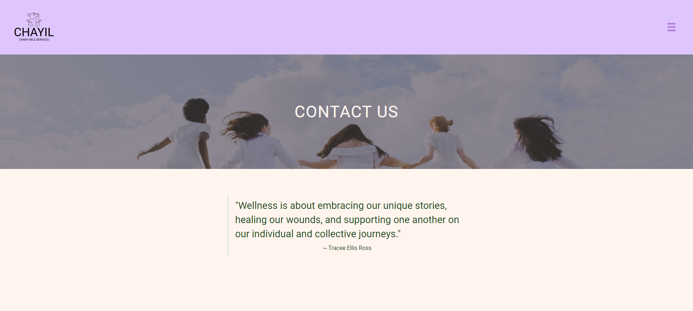
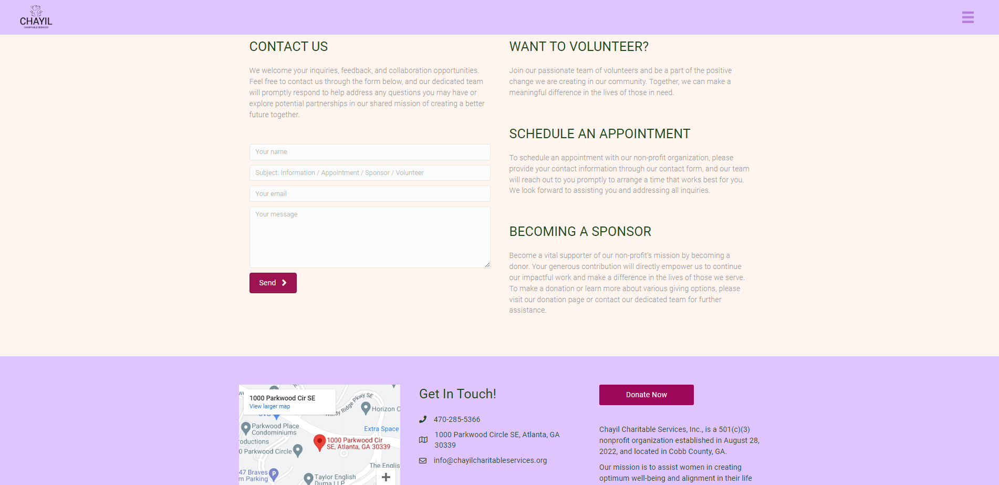

# Chayil 48in48

## Details

This project was a collaboration with a program called 48in48 which is designed for developers to come together for 48 hours and build a website for one of 48 different non-profit's. My team, consisting of myself and three others, built a website for the non-profit Chayil Charitable Services. Our client requested a clean and professional webpage where she could inform users about new events, create blog posts, share a wealth of information, and ultimately receive donations towards her cause.

## My Role

My role was to assist in the construction of the UI while under the supervision of our project manager. I also quickly became the person to go to when someone had a question about how to create or adjust a certain element of the page they were working on. As a guide in the field I aim to specialize in, we were able to collaborate with ease and come up with a phenomenal end product all within 48 hours.

From this experience I learned on a professional level how to be assigned a role and complete it within a certain amount of time, communicate with a client on what they are specifically looking for, and branch out my own skill set on an alternative platform.

Due to 48in48 finishing up the setup of the website, I am only able to show some of our final product.

## Final Thoughts

I am greatly appreciative of the opportunity I was given and the experience I received is immense. My teammates were wonderful and we would not have had the website go as great as it did without each one of us leading in our own segments.

# Preview:

# Homepage

# The Team

# Contact Page

# Thank You

Anyone who would be interested in learning more about 48in48 I would encourage you to go to their website and look at their next rounds. Should you have any questions you would like to ask me about my own experience, I would be more than happy to have a conversation. Overall, this was a wonderful experience through 48in48 that I can take to my next collaborative project.